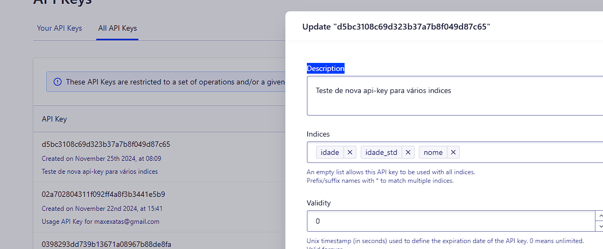
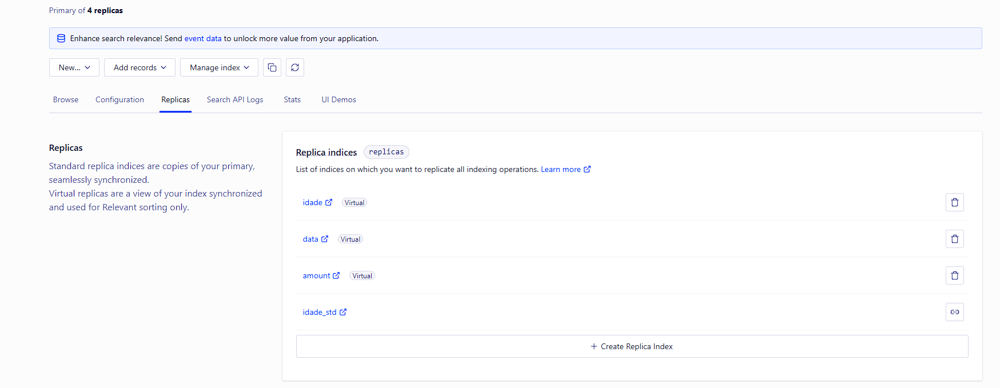
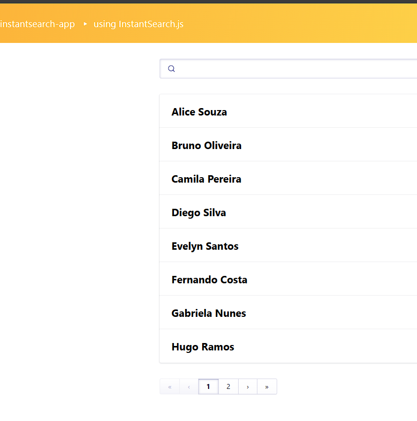
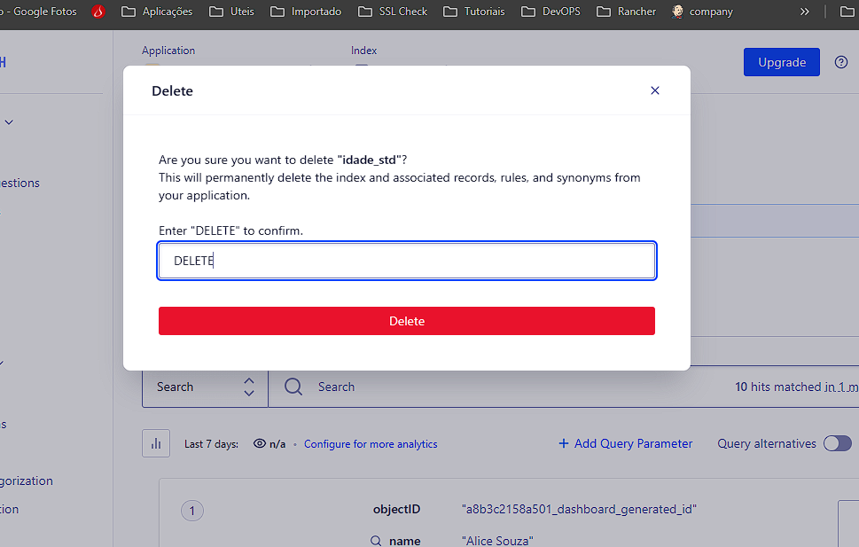
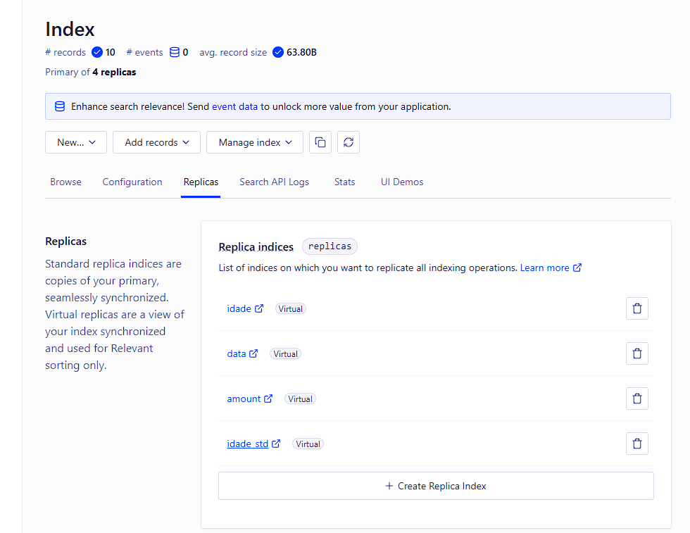
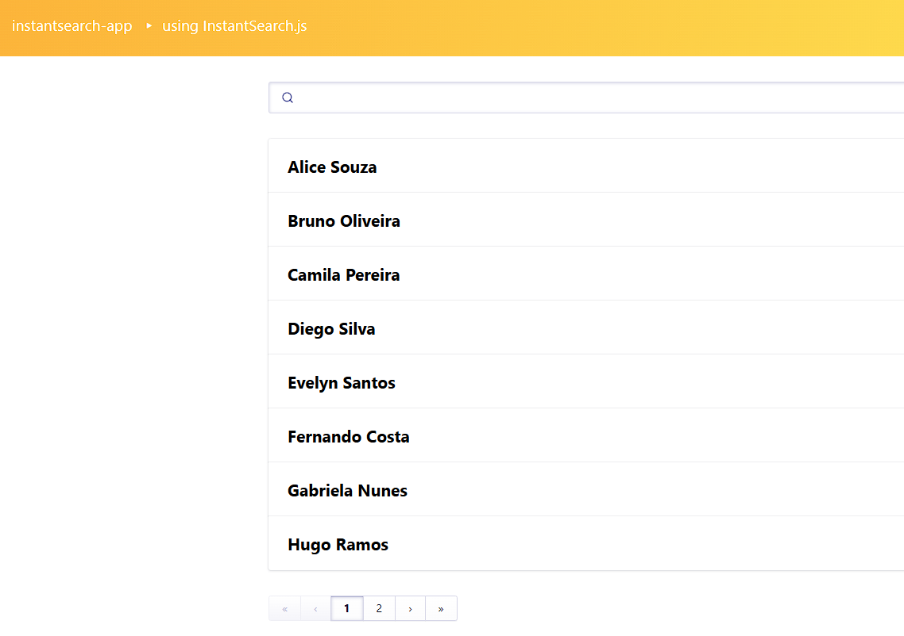

# Tipo de conta
Pode ser necessário o upgrade para uma conta premium

# Keys
Foi possível criar índices virtuais novos e adicioná-los nas Keys existentes

# Legado

Foi possível excluir um índice padrão e criar um novo com o mesmo nome de forma transparente.

## Legado idade_std:

## Exclusão do índice:

## Recriação com mesmo nome e com tipo diferente:
Ao criar o índice virtual, as mesmas configurações de ordenação devem ser recriadas no índice novo.

